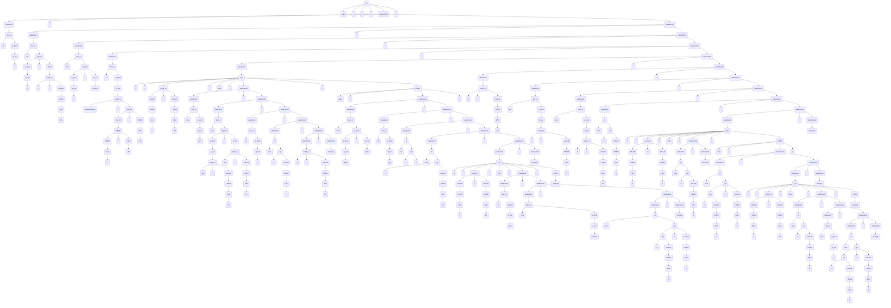

```mermaid
graph TD
168(d_nat) --> 5("r");
169(d_prod) --> 168(d_nat);
170(dec_st) --> 4("int");
170(dec_st) --> 169(d_prod);
171(statement) --> 170(dec_st);
172(d_nat) --> 8("x");
173(d_prod) --> 172(d_nat);
174(FAC) --> 12("6.5");
175(TERM) --> 174(FAC);
176(VALUE) --> 175(TERM);
177(math_st) --> 10("y");
177(math_st) --> 11("=");
177(math_st) --> 176(VALUE);
178(d_nat) --> 177(math_st);
179(d_prod) --> 173(d_prod);
179(d_prod) --> 9(",");
179(d_prod) --> 178(d_nat);
180(dec_st) --> 7("real");
180(dec_st) --> 179(d_prod);
181(statement) --> 180(dec_st);
182(d_nat) --> 15("z");
183(d_prod) --> 182(d_nat);
184(d_nat) --> 17("another");
185(d_prod) --> 183(d_prod);
185(d_prod) --> 16(",");
185(d_prod) --> 184(d_nat);
186(dec_st) --> 14("char");
186(dec_st) --> 185(d_prod);
187(statement) --> 186(dec_st);
188(FAC) --> 22("6");
189(TERM) --> 188(FAC);
190(FAC) --> 24("20");
191(TERM) --> 189(TERM);
191(TERM) --> 23("*");
191(TERM) --> 190(FAC);
192(VALUE) --> 191(TERM);
193(FAC) --> 26("100");
194(TERM) --> 193(FAC);
195(VALUE) --> 192(VALUE);
195(VALUE) --> 25("-");
195(VALUE) --> 194(TERM);
196(math_st) --> 20("anirbantesting");
196(math_st) --> 21("=");
196(math_st) --> 195(VALUE);
197(d_nat) --> 196(math_st);
198(d_prod) --> 197(d_nat);
199(dec_st) --> 19("int");
199(dec_st) --> 198(d_prod);
200(statement) --> 199(dec_st);
201(FAC) --> 30("x");
202(TERM) --> 201(FAC);
203(VALUE) --> 202(TERM);
204(FAC) --> 32("20");
205(TERM) --> 204(FAC);
206(VALUE) --> 205(TERM);
207(comp_st) --> 203(VALUE);
207(comp_st) --> 31(">");
207(comp_st) --> 206(VALUE);
208(d_nat) --> 37("eps");
209(d_prod) --> 208(d_nat);
210(dec_st) --> 36("char");
210(dec_st) --> 209(d_prod);
211(statement) --> 210(dec_st);
212(FAC) --> 42("2.3");
213(TERM) --> 212(FAC);
214(VALUE) --> 213(TERM);
215(math_st) --> 40("def");
215(math_st) --> 41("=");
215(math_st) --> 214(VALUE);
216(d_nat) --> 215(math_st);
217(d_prod) --> 216(d_nat);
218(FAC) --> 46("4.5");
219(TERM) --> 218(FAC);
220(VALUE) --> 219(TERM);
221(math_st) --> 44("abc");
221(math_st) --> 45("=");
221(math_st) --> 220(VALUE);
222(d_nat) --> 221(math_st);
223(d_prod) --> 217(d_prod);
223(d_prod) --> 43(",");
223(d_prod) --> 222(d_nat);
224(dec_st) --> 39("real");
224(dec_st) --> 223(d_prod);
225(statement) --> 224(dec_st);
226(d_nat) --> 49("z");
227(d_prod) --> 226(d_nat);
228(dec_st) --> 48("int");
228(dec_st) --> 227(d_prod);
229(statement) --> 228(dec_st);
230(FAC) --> 53("'Y'");
231(TERM) --> 230(FAC);
232(VALUE) --> 231(TERM);
233(opt) --> 52("<<");
233(opt) --> 232(VALUE);
234(io) --> 51("cout");
234(io) --> 233(opt);
235(statement) --> 234(io);
236(FAC) --> 57("20");
237(TERM) --> 236(FAC);
238(VALUE) --> 237(TERM);
239(math_st) --> 55("x");
239(math_st) --> 56("=");
239(math_st) --> 238(VALUE);
240(statement) --> 239(math_st);
242(statements) --> 241(%empty);
243(statements) --> 240(statement);
243(statements) --> 58(";");
243(statements) --> 242(statements);
244(statements) --> 235(statement);
244(statements) --> 54(";");
244(statements) --> 243(statements);
245(statements) --> 229(statement);
245(statements) --> 50(";");
245(statements) --> 244(statements);
246(statements) --> 225(statement);
246(statements) --> 47(";");
246(statements) --> 245(statements);
247(statements) --> 211(statement);
247(statements) --> 38(";");
247(statements) --> 246(statements);
248(d_nat) --> 63("alpha");
249(d_prod) --> 248(d_nat);
250(d_nat) --> 65("beta");
251(d_prod) --> 249(d_prod);
251(d_prod) --> 64(",");
251(d_prod) --> 250(d_nat);
252(dec_st) --> 62("char");
252(dec_st) --> 251(d_prod);
253(statement) --> 252(dec_st);
254(d_nat) --> 68("gg");
255(d_prod) --> 254(d_nat);
256(dec_st) --> 67("int");
256(dec_st) --> 255(d_prod);
257(statement) --> 256(dec_st);
258(inp) --> 71(">>");
258(inp) --> 72("x");
259(io) --> 70("cin");
259(io) --> 258(inp);
260(statement) --> 259(io);
261(FAC) --> 76("'N'");
262(TERM) --> 261(FAC);
263(VALUE) --> 262(TERM);
264(opt) --> 75("<<");
264(opt) --> 263(VALUE);
265(io) --> 74("cout");
265(io) --> 264(opt);
266(statement) --> 265(io);
267(FAC) --> 80("x");
268(TERM) --> 267(FAC);
269(VALUE) --> 268(TERM);
270(FAC) --> 82("10");
271(TERM) --> 270(FAC);
272(VALUE) --> 271(TERM);
273(comp_st) --> 269(VALUE);
273(comp_st) --> 81(">");
273(comp_st) --> 272(VALUE);
274(d_nat) --> 87("num");
275(d_prod) --> 274(d_nat);
276(dec_st) --> 86("int");
276(dec_st) --> 275(d_prod);
277(statement) --> 276(dec_st);
278(d_nat) --> 90("number");
279(d_prod) --> 278(d_nat);
280(dec_st) --> 89("real");
280(dec_st) --> 279(d_prod);
281(statement) --> 280(dec_st);
282(FAC) --> 94("'Y'");
283(TERM) --> 282(FAC);
284(VALUE) --> 283(TERM);
285(opt) --> 93("<<");
285(opt) --> 284(VALUE);
286(FAC) --> 96("x");
287(TERM) --> 286(FAC);
288(VALUE) --> 287(TERM);
289(opt) --> 285(opt);
289(opt) --> 95("<<");
289(opt) --> 288(VALUE);
290(io) --> 92("cout");
290(io) --> 289(opt);
291(statement) --> 290(io);
293(statements) --> 292(%empty);
294(statements) --> 291(statement);
294(statements) --> 97(";");
294(statements) --> 293(statements);
295(statements) --> 281(statement);
295(statements) --> 91(";");
295(statements) --> 294(statements);
296(statements) --> 277(statement);
296(statements) --> 88(";");
296(statements) --> 295(statements);
298(CONT) --> 297(%empty);
299(if_st) --> 78("if");
299(if_st) --> 79("(");
299(if_st) --> 273(comp_st);
299(if_st) --> 83(")");
299(if_st) --> 84("then");
299(if_st) --> 85("{");
299(if_st) --> 296(statements);
299(if_st) --> 98("}");
299(if_st) --> 298(CONT);
300(statement) --> 299(if_st);
302(statements) --> 301(%empty);
303(statements) --> 300(statement);
303(statements) --> 99(";");
303(statements) --> 302(statements);
304(statements) --> 266(statement);
304(statements) --> 77(";");
304(statements) --> 303(statements);
305(statements) --> 260(statement);
305(statements) --> 73(";");
305(statements) --> 304(statements);
306(statements) --> 257(statement);
306(statements) --> 69(";");
306(statements) --> 305(statements);
307(statements) --> 253(statement);
307(statements) --> 66(";");
307(statements) --> 306(statements);
308(CONT) --> 60("else");
308(CONT) --> 61("{");
308(CONT) --> 307(statements);
308(CONT) --> 100("}");
309(if_st) --> 28("if");
309(if_st) --> 29("(");
309(if_st) --> 207(comp_st);
309(if_st) --> 33(")");
309(if_st) --> 34("then");
309(if_st) --> 35("{");
309(if_st) --> 247(statements);
309(if_st) --> 59("}");
309(if_st) --> 308(CONT);
310(statement) --> 309(if_st);
311(FAC) --> 104("20");
312(TERM) --> 311(FAC);
313(VALUE) --> 312(TERM);
314(math_st) --> 102("x");
314(math_st) --> 103("=");
314(math_st) --> 313(VALUE);
315(statement) --> 314(math_st);
316(FAC) --> 109("5");
317(TERM) --> 316(FAC);
318(VALUE) --> 317(TERM);
319(math_st) --> 107("a");
319(math_st) --> 108("=");
319(math_st) --> 318(VALUE);
320(d_nat) --> 319(math_st);
321(d_prod) --> 320(d_nat);
322(dec_st) --> 106("int");
322(dec_st) --> 321(d_prod);
323(statement) --> 322(dec_st);
324(FAC) --> 114("3.2");
325(TERM) --> 324(FAC);
326(VALUE) --> 325(TERM);
327(math_st) --> 112("b");
327(math_st) --> 113("=");
327(math_st) --> 326(VALUE);
328(d_nat) --> 327(math_st);
329(d_prod) --> 328(d_nat);
330(dec_st) --> 111("real");
330(dec_st) --> 329(d_prod);
331(statement) --> 330(dec_st);
332(FAC) --> 118("a");
333(TERM) --> 332(FAC);
334(VALUE) --> 333(TERM);
335(opt) --> 117("<<");
335(opt) --> 334(VALUE);
336(io) --> 116("cout");
336(io) --> 335(opt);
337(statement) --> 336(io);
338(FAC) --> 122("a");
339(TERM) --> 338(FAC);
340(VALUE) --> 339(TERM);
341(FAC) --> 124("5");
342(TERM) --> 341(FAC);
343(VALUE) --> 342(TERM);
344(comp_st) --> 340(VALUE);
344(comp_st) --> 123("==");
344(comp_st) --> 343(VALUE);
345(FAC) --> 130("b");
346(TERM) --> 345(FAC);
347(VALUE) --> 346(TERM);
348(opt) --> 129("<<");
348(opt) --> 347(VALUE);
349(io) --> 128("cout");
349(io) --> 348(opt);
350(statement) --> 349(io);
352(statements) --> 351(%empty);
353(statements) --> 350(statement);
353(statements) --> 131(";");
353(statements) --> 352(statements);
354(FAC) --> 137("a");
355(TERM) --> 354(FAC);
356(VALUE) --> 355(TERM);
357(opt) --> 136("<<");
357(opt) --> 356(VALUE);
358(FAC) --> 139("b");
359(TERM) --> 358(FAC);
360(VALUE) --> 359(TERM);
361(opt) --> 357(opt);
361(opt) --> 138("<<");
361(opt) --> 360(VALUE);
362(io) --> 135("cout");
362(io) --> 361(opt);
363(statement) --> 362(io);
364(FAC) --> 143("a");
365(TERM) --> 364(FAC);
366(VALUE) --> 365(TERM);
367(FAC) --> 145("10");
368(TERM) --> 367(FAC);
369(VALUE) --> 368(TERM);
370(comp_st) --> 366(VALUE);
370(comp_st) --> 144(">");
370(comp_st) --> 369(VALUE);
371(FAC) --> 151("io");
372(TERM) --> 371(FAC);
373(VALUE) --> 372(TERM);
374(opt) --> 150("<<");
374(opt) --> 373(VALUE);
375(io) --> 149("cout");
375(io) --> 374(opt);
376(statement) --> 375(io);
377(d_nat) --> 154("io");
378(d_prod) --> 377(d_nat);
379(dec_st) --> 153("real");
379(dec_st) --> 378(d_prod);
380(statement) --> 379(dec_st);
381(FAC) --> 158("'Z'");
382(TERM) --> 381(FAC);
383(VALUE) --> 382(TERM);
384(opt) --> 157("<<");
384(opt) --> 383(VALUE);
385(FAC) --> 160("a");
386(TERM) --> 385(FAC);
387(VALUE) --> 386(TERM);
388(opt) --> 384(opt);
388(opt) --> 159("<<");
388(opt) --> 387(VALUE);
389(io) --> 156("cout");
389(io) --> 388(opt);
390(statement) --> 389(io);
392(statements) --> 391(%empty);
393(statements) --> 390(statement);
393(statements) --> 161(";");
393(statements) --> 392(statements);
394(statements) --> 380(statement);
394(statements) --> 155(";");
394(statements) --> 393(statements);
395(statements) --> 376(statement);
395(statements) --> 152(";");
395(statements) --> 394(statements);
397(CONT) --> 396(%empty);
398(if_st) --> 141("if");
398(if_st) --> 142("(");
398(if_st) --> 370(comp_st);
398(if_st) --> 146(")");
398(if_st) --> 147("then");
398(if_st) --> 148("{");
398(if_st) --> 395(statements);
398(if_st) --> 162("}");
398(if_st) --> 397(CONT);
399(statement) --> 398(if_st);
401(statements) --> 400(%empty);
402(statements) --> 399(statement);
402(statements) --> 163(";");
402(statements) --> 401(statements);
403(statements) --> 363(statement);
403(statements) --> 140(";");
403(statements) --> 402(statements);
404(CONT) --> 133("else");
404(CONT) --> 134("{");
404(CONT) --> 403(statements);
404(CONT) --> 164("}");
405(if_st) --> 120("if");
405(if_st) --> 121("(");
405(if_st) --> 344(comp_st);
405(if_st) --> 125(")");
405(if_st) --> 126("then");
405(if_st) --> 127("{");
405(if_st) --> 353(statements);
405(if_st) --> 132("}");
405(if_st) --> 404(CONT);
406(statement) --> 405(if_st);
408(statements) --> 407(%empty);
409(statements) --> 406(statement);
409(statements) --> 165(";");
409(statements) --> 408(statements);
410(statements) --> 337(statement);
410(statements) --> 119(";");
410(statements) --> 409(statements);
411(statements) --> 331(statement);
411(statements) --> 115(";");
411(statements) --> 410(statements);
412(statements) --> 323(statement);
412(statements) --> 110(";");
412(statements) --> 411(statements);
413(statements) --> 315(statement);
413(statements) --> 105(";");
413(statements) --> 412(statements);
414(statements) --> 310(statement);
414(statements) --> 101(";");
414(statements) --> 413(statements);
415(statements) --> 200(statement);
415(statements) --> 27(";");
415(statements) --> 414(statements);
416(statements) --> 187(statement);
416(statements) --> 18(";");
416(statements) --> 415(statements);
417(statements) --> 181(statement);
417(statements) --> 13(";");
417(statements) --> 416(statements);
418(statements) --> 171(statement);
418(statements) --> 6(";");
418(statements) --> 417(statements);
419(St) --> 0("main");
419(St) --> 1("(");
419(St) --> 2(")");
419(St) --> 3("{");
419(St) --> 418(statements);
419(St) --> 166("}");
```
