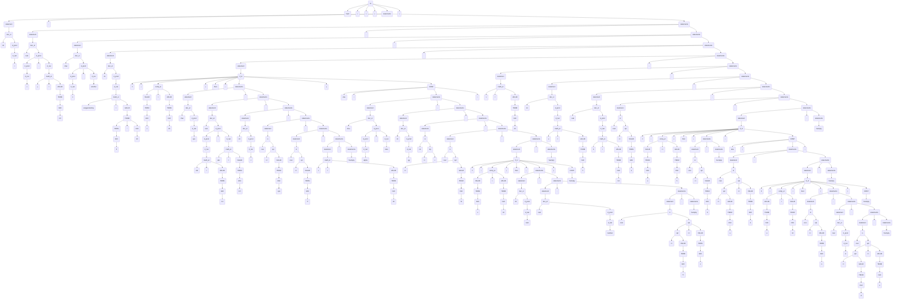

```mermaid
graph TD
170(d_nat) --> 5("r");
171(d_prod) --> 170(d_nat);
172(dec_st) --> 4("int");
172(dec_st) --> 171(d_prod);
173(statement) --> 172(dec_st);
174(d_nat) --> 8("x");
175(d_prod) --> 174(d_nat);
176(FAC) --> 12("6.5");
177(TERM) --> 176(FAC);
178(VALUE) --> 177(TERM);
179(math_st) --> 10("y");
179(math_st) --> 11("=");
179(math_st) --> 178(VALUE);
180(d_nat) --> 179(math_st);
181(d_prod) --> 175(d_prod);
181(d_prod) --> 9(",");
181(d_prod) --> 180(d_nat);
182(dec_st) --> 7("real");
182(dec_st) --> 181(d_prod);
183(statement) --> 182(dec_st);
184(d_nat) --> 15("z");
185(d_prod) --> 184(d_nat);
186(d_nat) --> 17("another");
187(d_prod) --> 185(d_prod);
187(d_prod) --> 16(",");
187(d_prod) --> 186(d_nat);
188(dec_st) --> 14("char");
188(dec_st) --> 187(d_prod);
189(statement) --> 188(dec_st);
190(FAC) --> 22("6");
191(TERM) --> 190(FAC);
192(FAC) --> 24("20");
193(TERM) --> 191(TERM);
193(TERM) --> 23("*");
193(TERM) --> 192(FAC);
194(VALUE) --> 193(TERM);
195(math_st) --> 20("avigyantesting");
195(math_st) --> 21("=");
195(math_st) --> 194(VALUE);
196(d_nat) --> 195(math_st);
197(d_prod) --> 196(d_nat);
198(dec_st) --> 19("int");
198(dec_st) --> 197(d_prod);
199(statement) --> 198(dec_st);
200(FAC) --> 28("x");
201(TERM) --> 200(FAC);
202(VALUE) --> 201(TERM);
203(FAC) --> 30("20");
204(TERM) --> 203(FAC);
205(VALUE) --> 204(TERM);
206(comp_st) --> 202(VALUE);
206(comp_st) --> 29(">");
206(comp_st) --> 205(VALUE);
207(d_nat) --> 35("spe");
208(d_prod) --> 207(d_nat);
209(dec_st) --> 34("char");
209(dec_st) --> 208(d_prod);
210(statement) --> 209(dec_st);
211(FAC) --> 40("2.3");
212(TERM) --> 211(FAC);
213(VALUE) --> 212(TERM);
214(math_st) --> 38("def");
214(math_st) --> 39("=");
214(math_st) --> 213(VALUE);
215(d_nat) --> 214(math_st);
216(d_prod) --> 215(d_nat);
217(FAC) --> 44("4.5");
218(TERM) --> 217(FAC);
219(VALUE) --> 218(TERM);
220(math_st) --> 42("abc");
220(math_st) --> 43("=");
220(math_st) --> 219(VALUE);
221(d_nat) --> 220(math_st);
222(d_prod) --> 216(d_prod);
222(d_prod) --> 41(",");
222(d_prod) --> 221(d_nat);
223(dec_st) --> 37("real");
223(dec_st) --> 222(d_prod);
224(statement) --> 223(dec_st);
225(d_nat) --> 47("z");
226(d_prod) --> 225(d_nat);
227(dec_st) --> 46("int");
227(dec_st) --> 226(d_prod);
228(statement) --> 227(dec_st);
229(FAC) --> 51("eps");
230(TERM) --> 229(FAC);
231(VALUE) --> 230(TERM);
232(opt) --> 50("<<");
232(opt) --> 231(VALUE);
233(io) --> 49("cout");
233(io) --> 232(opt);
234(statement) --> 233(io);
235(FAC) --> 55("'Y'");
236(TERM) --> 235(FAC);
237(VALUE) --> 236(TERM);
238(opt) --> 54("<<");
238(opt) --> 237(VALUE);
239(io) --> 53("cout");
239(io) --> 238(opt);
240(statement) --> 239(io);
241(FAC) --> 59("20");
242(TERM) --> 241(FAC);
243(VALUE) --> 242(TERM);
244(math_st) --> 57("x");
244(math_st) --> 58("=");
244(math_st) --> 243(VALUE);
245(statement) --> 244(math_st);
247(statements) --> 246(%empty);
248(statements) --> 245(statement);
248(statements) --> 60(";");
248(statements) --> 247(statements);
249(statements) --> 240(statement);
249(statements) --> 56(";");
249(statements) --> 248(statements);
250(statements) --> 234(statement);
250(statements) --> 52(";");
250(statements) --> 249(statements);
251(statements) --> 228(statement);
251(statements) --> 48(";");
251(statements) --> 250(statements);
252(statements) --> 224(statement);
252(statements) --> 45(";");
252(statements) --> 251(statements);
253(statements) --> 210(statement);
253(statements) --> 36(";");
253(statements) --> 252(statements);
254(d_nat) --> 65("alpha");
255(d_prod) --> 254(d_nat);
256(d_nat) --> 67("beta");
257(d_prod) --> 255(d_prod);
257(d_prod) --> 66(",");
257(d_prod) --> 256(d_nat);
258(dec_st) --> 64("char");
258(dec_st) --> 257(d_prod);
259(statement) --> 258(dec_st);
260(d_nat) --> 70("gg");
261(d_prod) --> 260(d_nat);
262(dec_st) --> 69("int");
262(dec_st) --> 261(d_prod);
263(statement) --> 262(dec_st);
264(inp) --> 73(">>");
264(inp) --> 74("x");
265(io) --> 72("cin");
265(io) --> 264(inp);
266(statement) --> 265(io);
267(FAC) --> 78("'N'");
268(TERM) --> 267(FAC);
269(VALUE) --> 268(TERM);
270(opt) --> 77("<<");
270(opt) --> 269(VALUE);
271(io) --> 76("cout");
271(io) --> 270(opt);
272(statement) --> 271(io);
273(FAC) --> 82("x");
274(TERM) --> 273(FAC);
275(VALUE) --> 274(TERM);
276(FAC) --> 84("10");
277(TERM) --> 276(FAC);
278(VALUE) --> 277(TERM);
279(comp_st) --> 275(VALUE);
279(comp_st) --> 83(">");
279(comp_st) --> 278(VALUE);
280(d_nat) --> 89("num");
281(d_prod) --> 280(d_nat);
282(dec_st) --> 88("int");
282(dec_st) --> 281(d_prod);
283(statement) --> 282(dec_st);
284(d_nat) --> 92("number");
285(d_prod) --> 284(d_nat);
286(dec_st) --> 91("real");
286(dec_st) --> 285(d_prod);
287(statement) --> 286(dec_st);
288(FAC) --> 96("'Y'");
289(TERM) --> 288(FAC);
290(VALUE) --> 289(TERM);
291(opt) --> 95("<<");
291(opt) --> 290(VALUE);
292(FAC) --> 98("x");
293(TERM) --> 292(FAC);
294(VALUE) --> 293(TERM);
295(opt) --> 291(opt);
295(opt) --> 97("<<");
295(opt) --> 294(VALUE);
296(io) --> 94("cout");
296(io) --> 295(opt);
297(statement) --> 296(io);
299(statements) --> 298(%empty);
300(statements) --> 297(statement);
300(statements) --> 99(";");
300(statements) --> 299(statements);
301(statements) --> 287(statement);
301(statements) --> 93(";");
301(statements) --> 300(statements);
302(statements) --> 283(statement);
302(statements) --> 90(";");
302(statements) --> 301(statements);
304(CONT) --> 303(%empty);
305(if_st) --> 80("if");
305(if_st) --> 81("(");
305(if_st) --> 279(comp_st);
305(if_st) --> 85(")");
305(if_st) --> 86("then");
305(if_st) --> 87("{");
305(if_st) --> 302(statements);
305(if_st) --> 100("}");
305(if_st) --> 304(CONT);
306(statement) --> 305(if_st);
308(statements) --> 307(%empty);
309(statements) --> 306(statement);
309(statements) --> 101(";");
309(statements) --> 308(statements);
310(statements) --> 272(statement);
310(statements) --> 79(";");
310(statements) --> 309(statements);
311(statements) --> 266(statement);
311(statements) --> 75(";");
311(statements) --> 310(statements);
312(statements) --> 263(statement);
312(statements) --> 71(";");
312(statements) --> 311(statements);
313(statements) --> 259(statement);
313(statements) --> 68(";");
313(statements) --> 312(statements);
314(CONT) --> 62("else");
314(CONT) --> 63("{");
314(CONT) --> 313(statements);
314(CONT) --> 102("}");
315(if_st) --> 26("if");
315(if_st) --> 27("(");
315(if_st) --> 206(comp_st);
315(if_st) --> 31(")");
315(if_st) --> 32("then");
315(if_st) --> 33("{");
315(if_st) --> 253(statements);
315(if_st) --> 61("}");
315(if_st) --> 314(CONT);
316(statement) --> 315(if_st);
317(FAC) --> 106("20");
318(TERM) --> 317(FAC);
319(VALUE) --> 318(TERM);
320(math_st) --> 104("x");
320(math_st) --> 105("=");
320(math_st) --> 319(VALUE);
321(statement) --> 320(math_st);
322(FAC) --> 111("5");
323(TERM) --> 322(FAC);
324(VALUE) --> 323(TERM);
325(math_st) --> 109("a");
325(math_st) --> 110("=");
325(math_st) --> 324(VALUE);
326(d_nat) --> 325(math_st);
327(d_prod) --> 326(d_nat);
328(dec_st) --> 108("int");
328(dec_st) --> 327(d_prod);
329(statement) --> 328(dec_st);
330(FAC) --> 116("3.2");
331(TERM) --> 330(FAC);
332(VALUE) --> 331(TERM);
333(math_st) --> 114("b");
333(math_st) --> 115("=");
333(math_st) --> 332(VALUE);
334(d_nat) --> 333(math_st);
335(d_prod) --> 334(d_nat);
336(dec_st) --> 113("real");
336(dec_st) --> 335(d_prod);
337(statement) --> 336(dec_st);
338(FAC) --> 120("a");
339(TERM) --> 338(FAC);
340(VALUE) --> 339(TERM);
341(opt) --> 119("<<");
341(opt) --> 340(VALUE);
342(io) --> 118("cout");
342(io) --> 341(opt);
343(statement) --> 342(io);
344(FAC) --> 124("a");
345(TERM) --> 344(FAC);
346(VALUE) --> 345(TERM);
347(FAC) --> 126("5");
348(TERM) --> 347(FAC);
349(VALUE) --> 348(TERM);
350(comp_st) --> 346(VALUE);
350(comp_st) --> 125("==");
350(comp_st) --> 349(VALUE);
351(FAC) --> 132("b");
352(TERM) --> 351(FAC);
353(VALUE) --> 352(TERM);
354(opt) --> 131("<<");
354(opt) --> 353(VALUE);
355(io) --> 130("cout");
355(io) --> 354(opt);
356(statement) --> 355(io);
358(statements) --> 357(%empty);
359(statements) --> 356(statement);
359(statements) --> 133(";");
359(statements) --> 358(statements);
360(FAC) --> 139("a");
361(TERM) --> 360(FAC);
362(VALUE) --> 361(TERM);
363(opt) --> 138("<<");
363(opt) --> 362(VALUE);
364(FAC) --> 141("b");
365(TERM) --> 364(FAC);
366(VALUE) --> 365(TERM);
367(opt) --> 363(opt);
367(opt) --> 140("<<");
367(opt) --> 366(VALUE);
368(io) --> 137("cout");
368(io) --> 367(opt);
369(statement) --> 368(io);
370(FAC) --> 145("a");
371(TERM) --> 370(FAC);
372(VALUE) --> 371(TERM);
373(FAC) --> 147("10");
374(TERM) --> 373(FAC);
375(VALUE) --> 374(TERM);
376(comp_st) --> 372(VALUE);
376(comp_st) --> 146(">");
376(comp_st) --> 375(VALUE);
377(FAC) --> 153("io");
378(TERM) --> 377(FAC);
379(VALUE) --> 378(TERM);
380(opt) --> 152("<<");
380(opt) --> 379(VALUE);
381(io) --> 151("cout");
381(io) --> 380(opt);
382(statement) --> 381(io);
383(d_nat) --> 156("io");
384(d_prod) --> 383(d_nat);
385(dec_st) --> 155("real");
385(dec_st) --> 384(d_prod);
386(statement) --> 385(dec_st);
387(FAC) --> 160("'Z'");
388(TERM) --> 387(FAC);
389(VALUE) --> 388(TERM);
390(opt) --> 159("<<");
390(opt) --> 389(VALUE);
391(FAC) --> 162("a");
392(TERM) --> 391(FAC);
393(VALUE) --> 392(TERM);
394(opt) --> 390(opt);
394(opt) --> 161("<<");
394(opt) --> 393(VALUE);
395(io) --> 158("cout");
395(io) --> 394(opt);
396(statement) --> 395(io);
398(statements) --> 397(%empty);
399(statements) --> 396(statement);
399(statements) --> 163(";");
399(statements) --> 398(statements);
400(statements) --> 386(statement);
400(statements) --> 157(";");
400(statements) --> 399(statements);
401(statements) --> 382(statement);
401(statements) --> 154(";");
401(statements) --> 400(statements);
403(CONT) --> 402(%empty);
404(if_st) --> 143("if");
404(if_st) --> 144("(");
404(if_st) --> 376(comp_st);
404(if_st) --> 148(")");
404(if_st) --> 149("then");
404(if_st) --> 150("{");
404(if_st) --> 401(statements);
404(if_st) --> 164("}");
404(if_st) --> 403(CONT);
405(statement) --> 404(if_st);
407(statements) --> 406(%empty);
408(statements) --> 405(statement);
408(statements) --> 165(";");
408(statements) --> 407(statements);
409(statements) --> 369(statement);
409(statements) --> 142(";");
409(statements) --> 408(statements);
410(CONT) --> 135("else");
410(CONT) --> 136("{");
410(CONT) --> 409(statements);
410(CONT) --> 166("}");
411(if_st) --> 122("if");
411(if_st) --> 123("(");
411(if_st) --> 350(comp_st);
411(if_st) --> 127(")");
411(if_st) --> 128("then");
411(if_st) --> 129("{");
411(if_st) --> 359(statements);
411(if_st) --> 134("}");
411(if_st) --> 410(CONT);
412(statement) --> 411(if_st);
414(statements) --> 413(%empty);
415(statements) --> 412(statement);
415(statements) --> 167(";");
415(statements) --> 414(statements);
416(statements) --> 343(statement);
416(statements) --> 121(";");
416(statements) --> 415(statements);
417(statements) --> 337(statement);
417(statements) --> 117(";");
417(statements) --> 416(statements);
418(statements) --> 329(statement);
418(statements) --> 112(";");
418(statements) --> 417(statements);
419(statements) --> 321(statement);
419(statements) --> 107(";");
419(statements) --> 418(statements);
420(statements) --> 316(statement);
420(statements) --> 103(";");
420(statements) --> 419(statements);
421(statements) --> 199(statement);
421(statements) --> 25(";");
421(statements) --> 420(statements);
422(statements) --> 189(statement);
422(statements) --> 18(";");
422(statements) --> 421(statements);
423(statements) --> 183(statement);
423(statements) --> 13(";");
423(statements) --> 422(statements);
424(statements) --> 173(statement);
424(statements) --> 6(";");
424(statements) --> 423(statements);
425(St) --> 0("main");
425(St) --> 1("(");
425(St) --> 2(")");
425(St) --> 3("{");
425(St) --> 424(statements);
425(St) --> 168("}");
```
