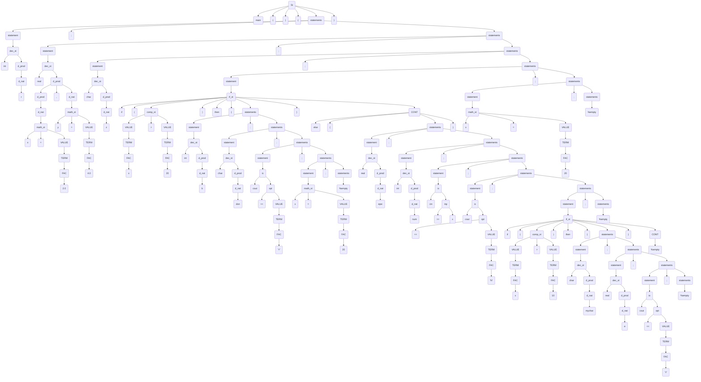

```mermaid
graph TD
86(d_nat) --> 5("r");
87(d_prod) --> 86(d_nat);
88(dec_st) --> 4("int");
88(dec_st) --> 87(d_prod);
89(statement) --> 88(dec_st);
90(FAC) --> 10("2.0");
91(TERM) --> 90(FAC);
92(VALUE) --> 91(TERM);
93(math_st) --> 8("x");
93(math_st) --> 9("=");
93(math_st) --> 92(VALUE);
94(d_nat) --> 93(math_st);
95(d_prod) --> 94(d_nat);
96(FAC) --> 14("4.0");
97(TERM) --> 96(FAC);
98(VALUE) --> 97(TERM);
99(math_st) --> 12("y");
99(math_st) --> 13("=");
99(math_st) --> 98(VALUE);
100(d_nat) --> 99(math_st);
101(d_prod) --> 95(d_prod);
101(d_prod) --> 11(",");
101(d_prod) --> 100(d_nat);
102(dec_st) --> 7("real");
102(dec_st) --> 101(d_prod);
103(statement) --> 102(dec_st);
104(d_nat) --> 17("z");
105(d_prod) --> 104(d_nat);
106(dec_st) --> 16("char");
106(dec_st) --> 105(d_prod);
107(statement) --> 106(dec_st);
108(FAC) --> 21("x");
109(TERM) --> 108(FAC);
110(VALUE) --> 109(TERM);
111(FAC) --> 23("20");
112(TERM) --> 111(FAC);
113(VALUE) --> 112(TERM);
114(comp_st) --> 110(VALUE);
114(comp_st) --> 22(">");
114(comp_st) --> 113(VALUE);
115(d_nat) --> 28("b");
116(d_prod) --> 115(d_nat);
117(dec_st) --> 27("int");
117(dec_st) --> 116(d_prod);
118(statement) --> 117(dec_st);
119(d_nat) --> 31("don");
120(d_prod) --> 119(d_nat);
121(dec_st) --> 30("char");
121(dec_st) --> 120(d_prod);
122(statement) --> 121(dec_st);
123(FAC) --> 35("'Y'");
124(TERM) --> 123(FAC);
125(VALUE) --> 124(TERM);
126(opt) --> 34("<<");
126(opt) --> 125(VALUE);
127(io) --> 33("cout");
127(io) --> 126(opt);
128(statement) --> 127(io);
129(FAC) --> 39("20");
130(TERM) --> 129(FAC);
131(VALUE) --> 130(TERM);
132(math_st) --> 37("x");
132(math_st) --> 38("=");
132(math_st) --> 131(VALUE);
133(statement) --> 132(math_st);
135(statements) --> 134(%empty);
136(statements) --> 133(statement);
136(statements) --> 40(";");
136(statements) --> 135(statements);
137(statements) --> 128(statement);
137(statements) --> 36(";");
137(statements) --> 136(statements);
138(statements) --> 122(statement);
138(statements) --> 32(";");
138(statements) --> 137(statements);
139(statements) --> 118(statement);
139(statements) --> 29(";");
139(statements) --> 138(statements);
140(d_nat) --> 45("epsi");
141(d_prod) --> 140(d_nat);
142(dec_st) --> 44("real");
142(dec_st) --> 141(d_prod);
143(statement) --> 142(dec_st);
144(d_nat) --> 48("num");
145(d_prod) --> 144(d_nat);
146(dec_st) --> 47("int");
146(dec_st) --> 145(d_prod);
147(statement) --> 146(dec_st);
148(inp) --> 51(">>");
148(inp) --> 52("x");
149(io) --> 50("cin");
149(io) --> 148(inp);
150(statement) --> 149(io);
151(FAC) --> 56("'N'");
152(TERM) --> 151(FAC);
153(VALUE) --> 152(TERM);
154(opt) --> 55("<<");
154(opt) --> 153(VALUE);
155(io) --> 54("cout");
155(io) --> 154(opt);
156(statement) --> 155(io);
157(FAC) --> 60("x");
158(TERM) --> 157(FAC);
159(VALUE) --> 158(TERM);
160(FAC) --> 62("10");
161(TERM) --> 160(FAC);
162(VALUE) --> 161(TERM);
163(comp_st) --> 159(VALUE);
163(comp_st) --> 61(">");
163(comp_st) --> 162(VALUE);
164(d_nat) --> 67("mychar");
165(d_prod) --> 164(d_nat);
166(dec_st) --> 66("char");
166(dec_st) --> 165(d_prod);
167(statement) --> 166(dec_st);
168(d_nat) --> 70("e");
169(d_prod) --> 168(d_nat);
170(dec_st) --> 69("real");
170(dec_st) --> 169(d_prod);
171(statement) --> 170(dec_st);
172(FAC) --> 74("'Y'");
173(TERM) --> 172(FAC);
174(VALUE) --> 173(TERM);
175(opt) --> 73("<<");
175(opt) --> 174(VALUE);
176(io) --> 72("cout");
176(io) --> 175(opt);
177(statement) --> 176(io);
179(statements) --> 178(%empty);
180(statements) --> 177(statement);
180(statements) --> 75(";");
180(statements) --> 179(statements);
181(statements) --> 171(statement);
181(statements) --> 71(";");
181(statements) --> 180(statements);
182(statements) --> 167(statement);
182(statements) --> 68(";");
182(statements) --> 181(statements);
184(CONT) --> 183(%empty);
185(if_st) --> 58("if");
185(if_st) --> 59("(");
185(if_st) --> 163(comp_st);
185(if_st) --> 63(")");
185(if_st) --> 64("then");
185(if_st) --> 65("{");
185(if_st) --> 182(statements);
185(if_st) --> 76("}");
185(if_st) --> 184(CONT);
186(statement) --> 185(if_st);
188(statements) --> 187(%empty);
189(statements) --> 186(statement);
189(statements) --> 77(";");
189(statements) --> 188(statements);
190(statements) --> 156(statement);
190(statements) --> 57(";");
190(statements) --> 189(statements);
191(statements) --> 150(statement);
191(statements) --> 53(";");
191(statements) --> 190(statements);
192(statements) --> 147(statement);
192(statements) --> 49(";");
192(statements) --> 191(statements);
193(statements) --> 143(statement);
193(statements) --> 46(";");
193(statements) --> 192(statements);
194(CONT) --> 42("else");
194(CONT) --> 43("{");
194(CONT) --> 193(statements);
194(CONT) --> 78("}");
195(if_st) --> 19("if");
195(if_st) --> 20("(");
195(if_st) --> 114(comp_st);
195(if_st) --> 24(")");
195(if_st) --> 25("then");
195(if_st) --> 26("{");
195(if_st) --> 139(statements);
195(if_st) --> 41("}");
195(if_st) --> 194(CONT);
196(statement) --> 195(if_st);
197(FAC) --> 82("20");
198(TERM) --> 197(FAC);
199(VALUE) --> 198(TERM);
200(math_st) --> 80("x");
200(math_st) --> 81("=");
200(math_st) --> 199(VALUE);
201(statement) --> 200(math_st);
203(statements) --> 202(%empty);
204(statements) --> 201(statement);
204(statements) --> 83(";");
204(statements) --> 203(statements);
205(statements) --> 196(statement);
205(statements) --> 79(";");
205(statements) --> 204(statements);
206(statements) --> 107(statement);
206(statements) --> 18(";");
206(statements) --> 205(statements);
207(statements) --> 103(statement);
207(statements) --> 15(";");
207(statements) --> 206(statements);
208(statements) --> 89(statement);
208(statements) --> 6(";");
208(statements) --> 207(statements);
209(St) --> 0("main");
209(St) --> 1("(");
209(St) --> 2(")");
209(St) --> 3("{");
209(St) --> 208(statements);
209(St) --> 84("}");
```
