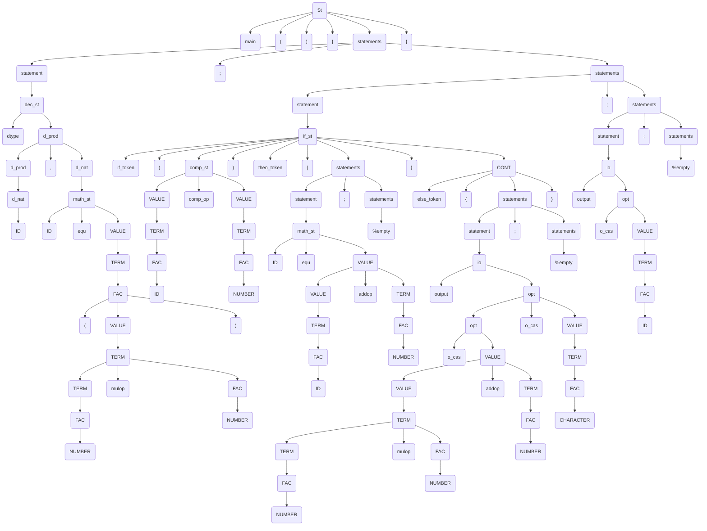

```mermaid
graph TD
50(d_nat) --> 5("ID");
51(d_prod) --> 50(d_nat);
52(FAC) --> 10("NUMBER");
53(TERM) --> 52(FAC);
54(FAC) --> 12("NUMBER");
55(TERM) --> 53(TERM);
55(TERM) --> 11("mulop");
55(TERM) --> 54(FAC);
56(VALUE) --> 55(TERM);
57(FAC) --> 9("(");
57(FAC) --> 56(VALUE);
57(FAC) --> 13(")");
58(TERM) --> 57(FAC);
59(VALUE) --> 58(TERM);
60(math_st) --> 7("ID");
60(math_st) --> 8("equ");
60(math_st) --> 59(VALUE);
61(d_nat) --> 60(math_st);
62(d_prod) --> 51(d_prod);
62(d_prod) --> 6(",");
62(d_prod) --> 61(d_nat);
63(dec_st) --> 4("dtype");
63(dec_st) --> 62(d_prod);
64(statement) --> 63(dec_st);
65(FAC) --> 17("ID");
66(TERM) --> 65(FAC);
67(VALUE) --> 66(TERM);
68(FAC) --> 19("NUMBER");
69(TERM) --> 68(FAC);
70(VALUE) --> 69(TERM);
71(comp_st) --> 67(VALUE);
71(comp_st) --> 18("comp_op");
71(comp_st) --> 70(VALUE);
72(FAC) --> 25("ID");
73(TERM) --> 72(FAC);
74(VALUE) --> 73(TERM);
75(FAC) --> 27("NUMBER");
76(TERM) --> 75(FAC);
77(VALUE) --> 74(VALUE);
77(VALUE) --> 26("addop");
77(VALUE) --> 76(TERM);
78(math_st) --> 23("ID");
78(math_st) --> 24("equ");
78(math_st) --> 77(VALUE);
79(statement) --> 78(math_st);
81(statements) --> 80(%empty);
82(statements) --> 79(statement);
82(statements) --> 28(";");
82(statements) --> 81(statements);
83(FAC) --> 34("NUMBER");
84(TERM) --> 83(FAC);
85(FAC) --> 36("NUMBER");
86(TERM) --> 84(TERM);
86(TERM) --> 35("mulop");
86(TERM) --> 85(FAC);
87(VALUE) --> 86(TERM);
88(FAC) --> 38("NUMBER");
89(TERM) --> 88(FAC);
90(VALUE) --> 87(VALUE);
90(VALUE) --> 37("addop");
90(VALUE) --> 89(TERM);
91(opt) --> 33("o_cas");
91(opt) --> 90(VALUE);
92(FAC) --> 40("CHARACTER");
93(TERM) --> 92(FAC);
94(VALUE) --> 93(TERM);
95(opt) --> 91(opt);
95(opt) --> 39("o_cas");
95(opt) --> 94(VALUE);
96(io) --> 32("output");
96(io) --> 95(opt);
97(statement) --> 96(io);
99(statements) --> 98(%empty);
100(statements) --> 97(statement);
100(statements) --> 41(";");
100(statements) --> 99(statements);
101(CONT) --> 30("else_token");
101(CONT) --> 31("{");
101(CONT) --> 100(statements);
101(CONT) --> 42("}");
102(if_st) --> 15("if_token");
102(if_st) --> 16("(");
102(if_st) --> 71(comp_st);
102(if_st) --> 20(")");
102(if_st) --> 21("then_token");
102(if_st) --> 22("{");
102(if_st) --> 82(statements);
102(if_st) --> 29("}");
102(if_st) --> 101(CONT);
103(statement) --> 102(if_st);
104(FAC) --> 46("ID");
105(TERM) --> 104(FAC);
106(VALUE) --> 105(TERM);
107(opt) --> 45("o_cas");
107(opt) --> 106(VALUE);
108(io) --> 44("output");
108(io) --> 107(opt);
109(statement) --> 108(io);
111(statements) --> 110(%empty);
112(statements) --> 109(statement);
112(statements) --> 47(";");
112(statements) --> 111(statements);
113(statements) --> 103(statement);
113(statements) --> 43(";");
113(statements) --> 112(statements);
114(statements) --> 64(statement);
114(statements) --> 14(";");
114(statements) --> 113(statements);
115(St) --> 0("main");
115(St) --> 1("(");
115(St) --> 2(")");
115(St) --> 3("{");
115(St) --> 114(statements);
115(St) --> 48("}");
```
